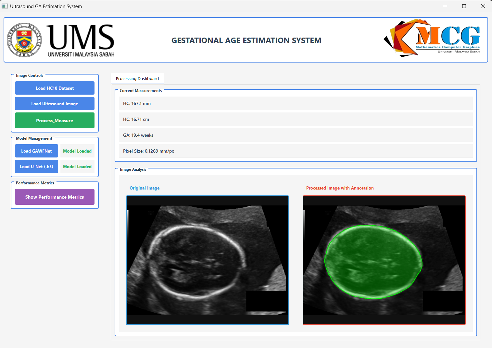
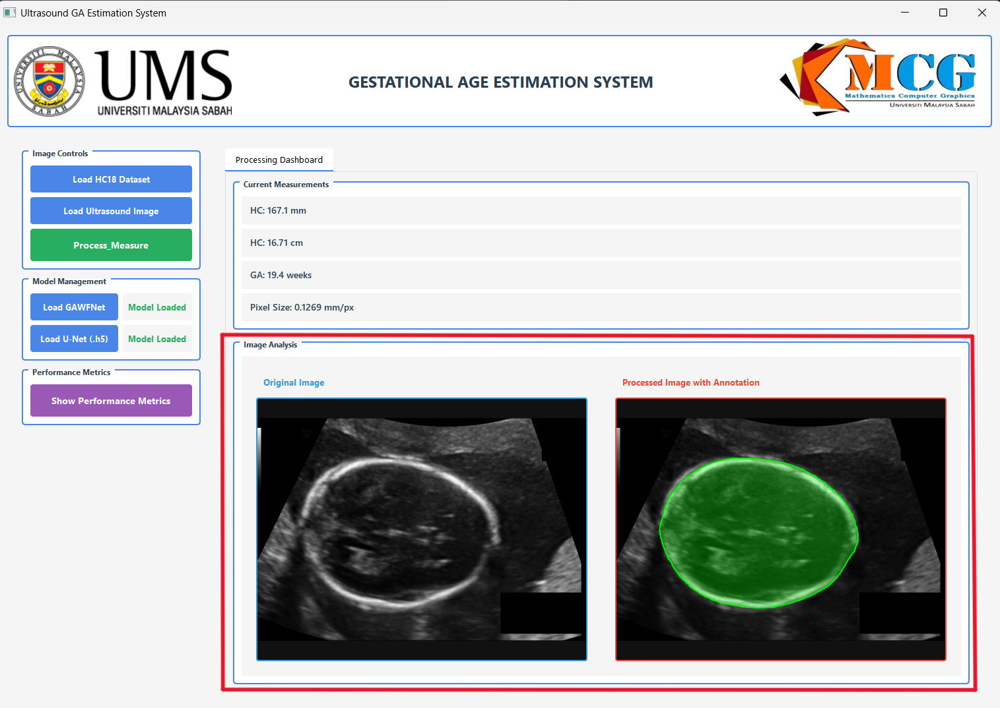
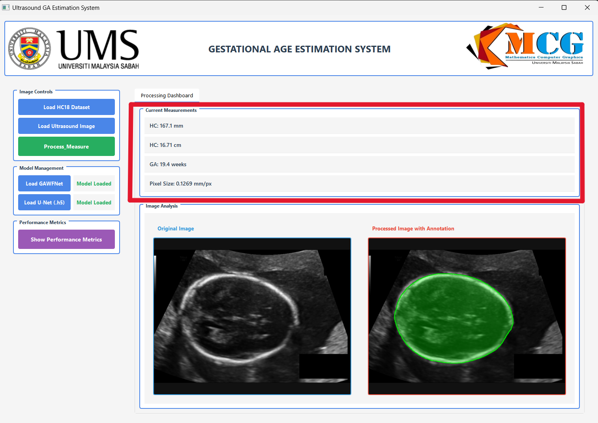

# Gestational Age Estimation System

## Description
This project is the final year project made by implementing a GA-conditioned deep learning denoising method to enhance the image and a U-Net with a shape regularization segmentation method to measure the head circumference, which later will be used to calculate the gestational age of fetus using Hadlock polynomial from ultrasound image.

## Technologies Used
- Python
- Deep Learning
- CNN
- CNN Structured Denoising Method
- U-Net Segmentation

## System Screenshots

### System Interface

### Segmentation Result

### Measurement Output

### Evaluation Metrics

### Evaluation Metrics

