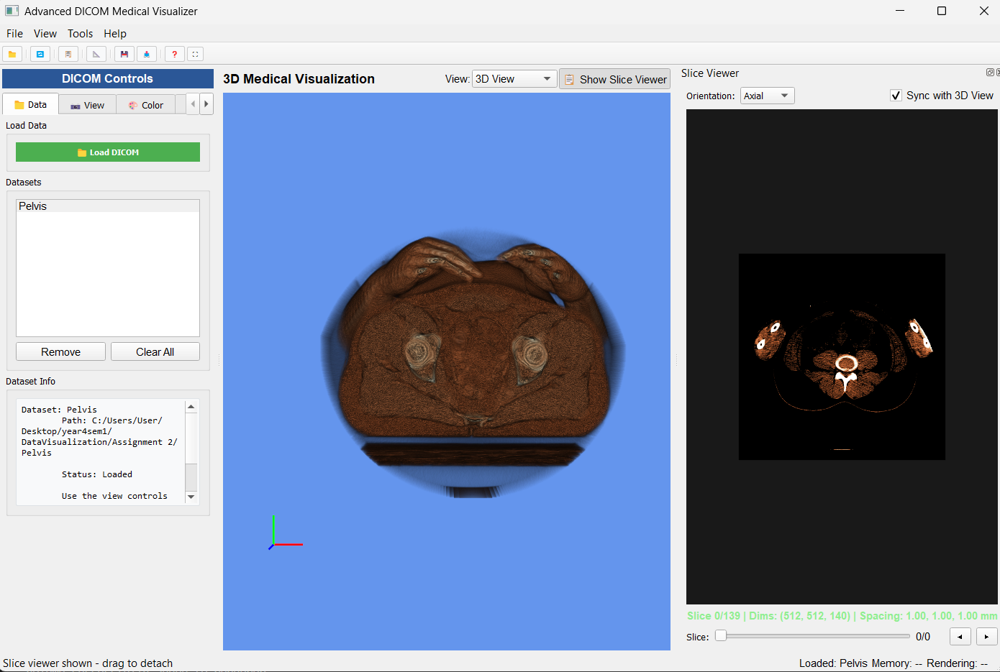
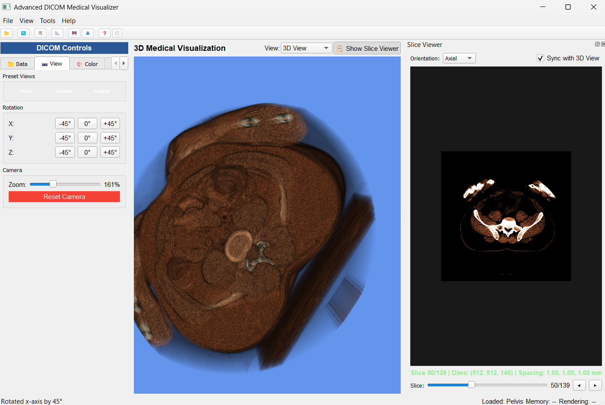
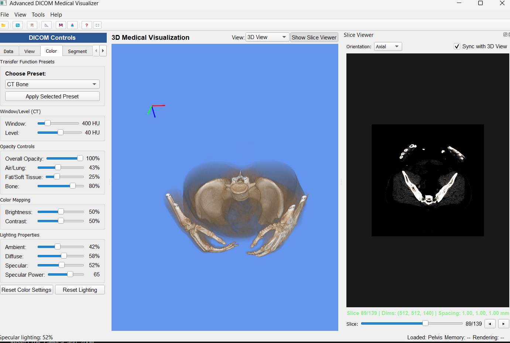
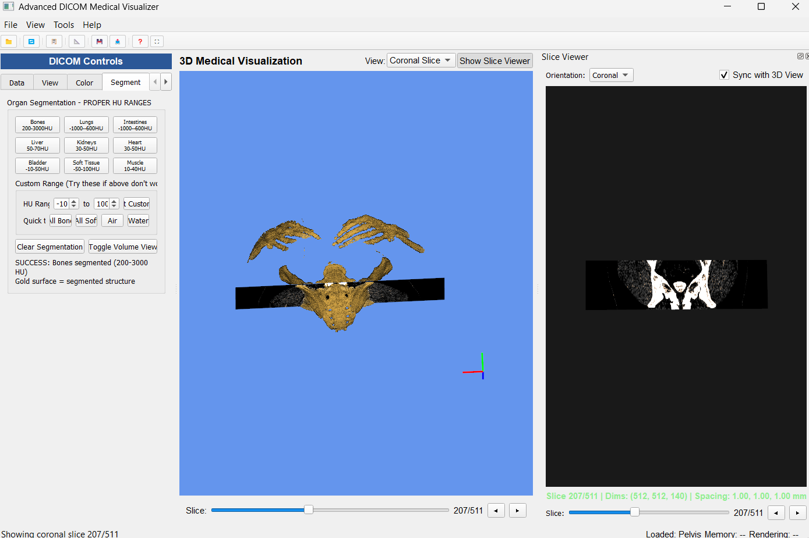
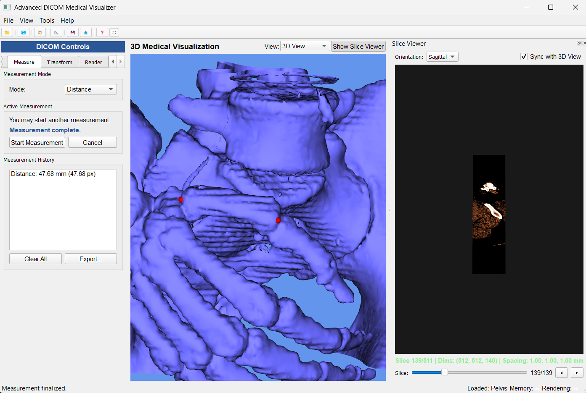
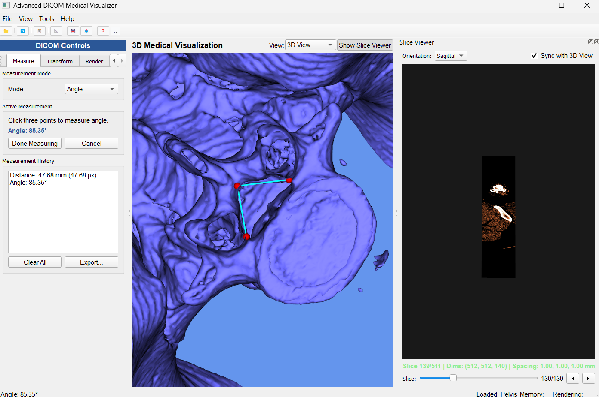
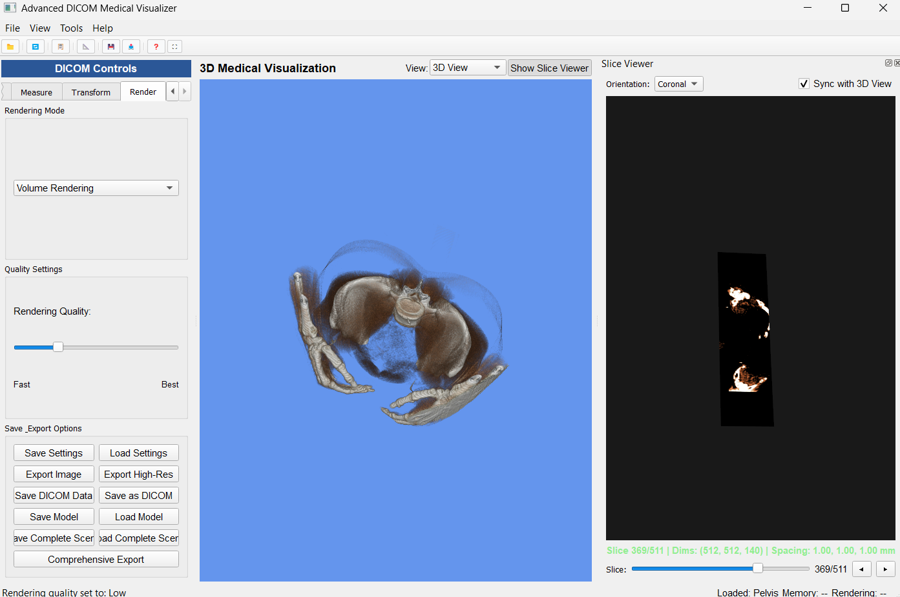

# Advanced DICOM Medical Visualizer

## Description
This project is a group of 2 assignment project that create a medical visualizer that accepts DICOM datasets to visualize the dataset with 3D volume rendering, multi-series support, segmentation, and measurement tools built with PyQt5 and VTK.

## Technologies Used
- Python
- PyQt5 
- VTK (Visualization Toolkit)
- PyDICOM
- NumPy
- SciPy
- DICOM Standard
- Volume Rendering
- Marching Cubes Algorithm
- Image Segmentation (Thresholding)
- Measurement Tools
- Multi-series DICOM Management

## System Screenshots

### System Interface

### Viewing the dataset

### Changing Color for better visualization

### Segment/Threshold dataset

### Measuring Distance

### Measuring Angle

### Rendering the dataset

