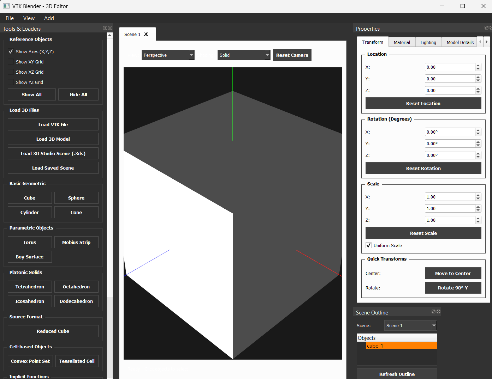
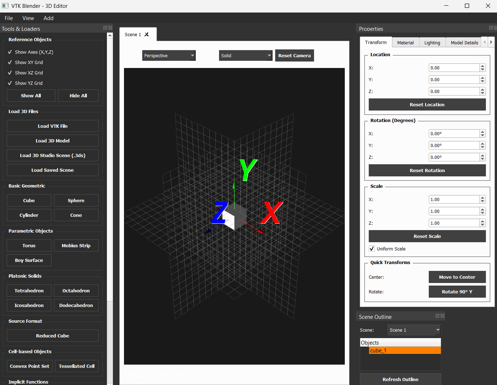
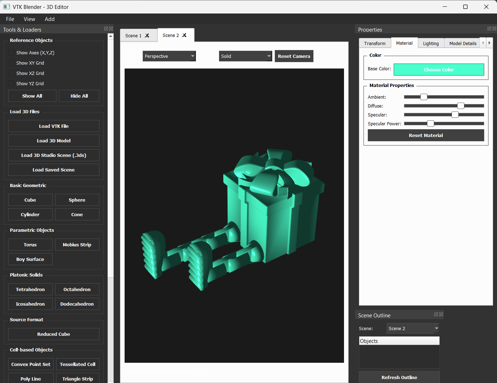
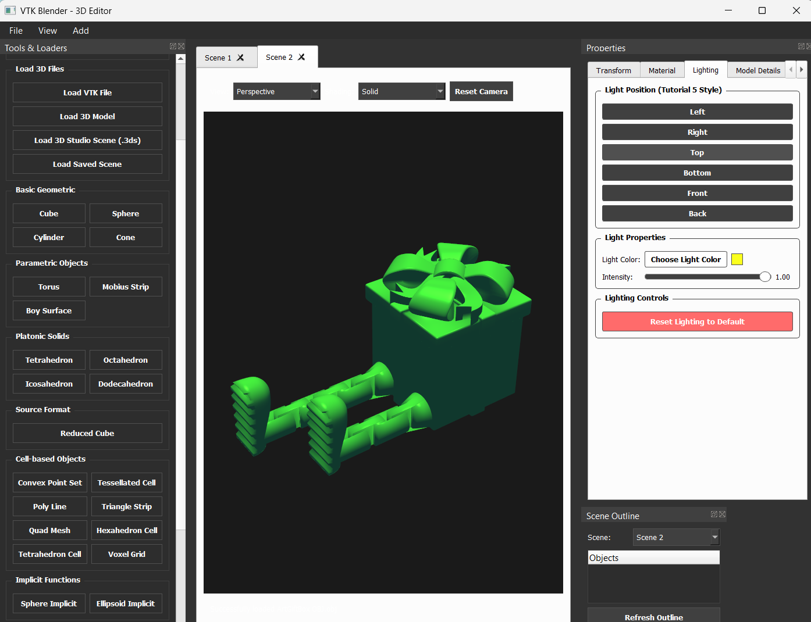
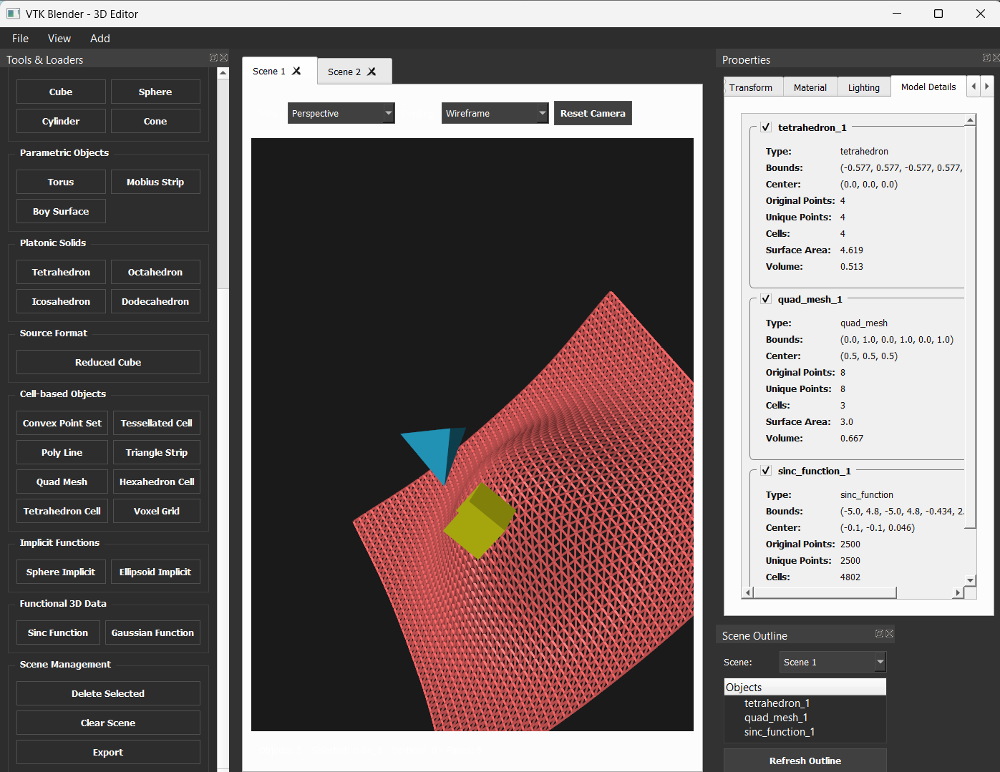
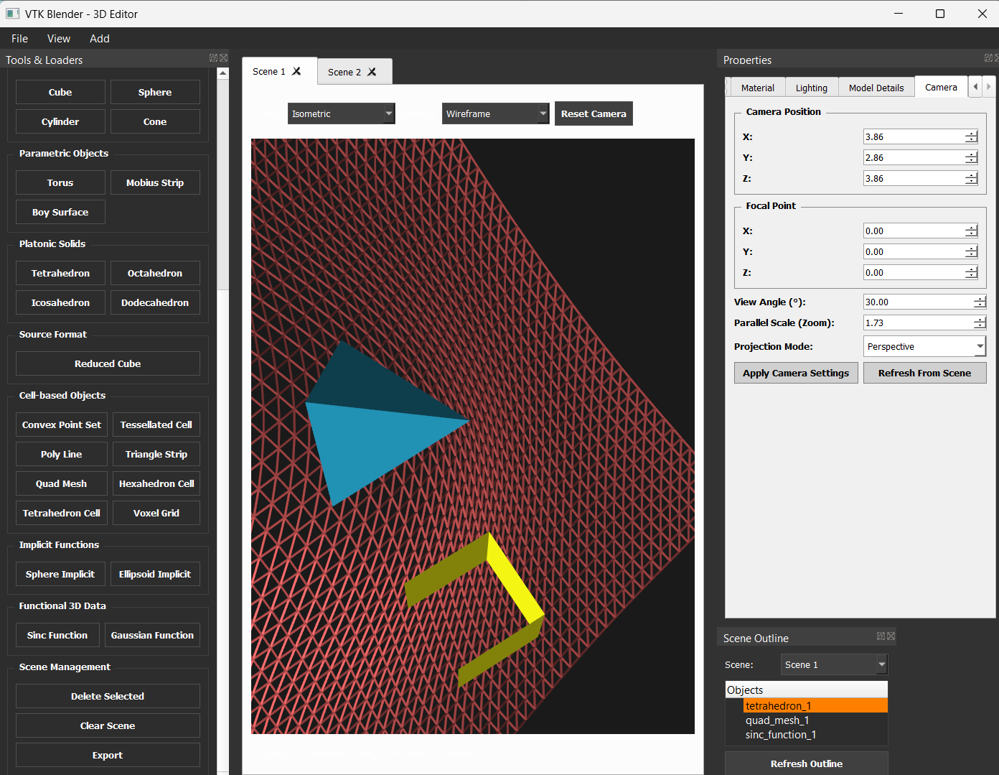

# 3D Blender

## Description
This project is a group of 4 assignment that requires students to create their own 3D Blender, a visualization application for creating, importing, editing, and exporting 3D objects with material properties, lighting controls, and multi-scene management.

## Technologies Used
- Python
- VTK (Visualization Toolkit)
- PyQt5
- NumPy
- 3D File Format Support
- Scene Management
- Material and Shading Systems
- Lighting Controls
- Camera Controls
- Object Picking and Selection
- Export/Import Functionality
- Model Statistics 

## System Screenshots

### System Interface

### Showing Grids and Axis

### Material and Shading Setting

### Lighting Setting

### Model Details

### Camera Setting

