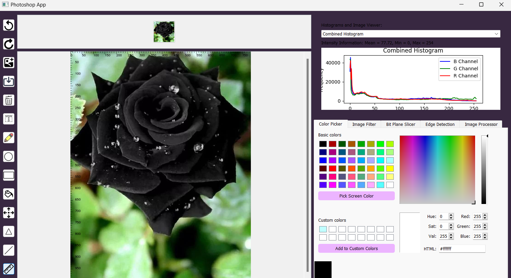
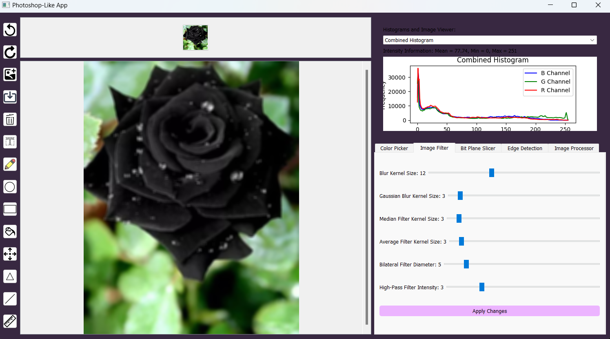
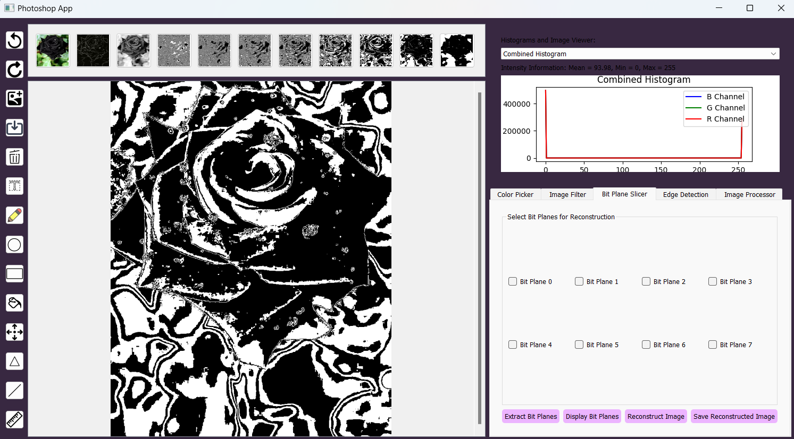
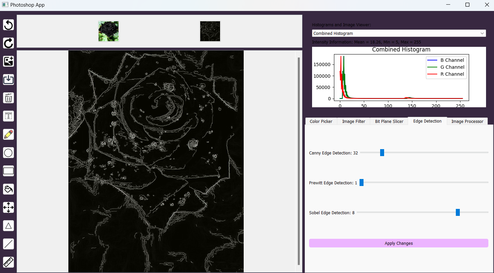
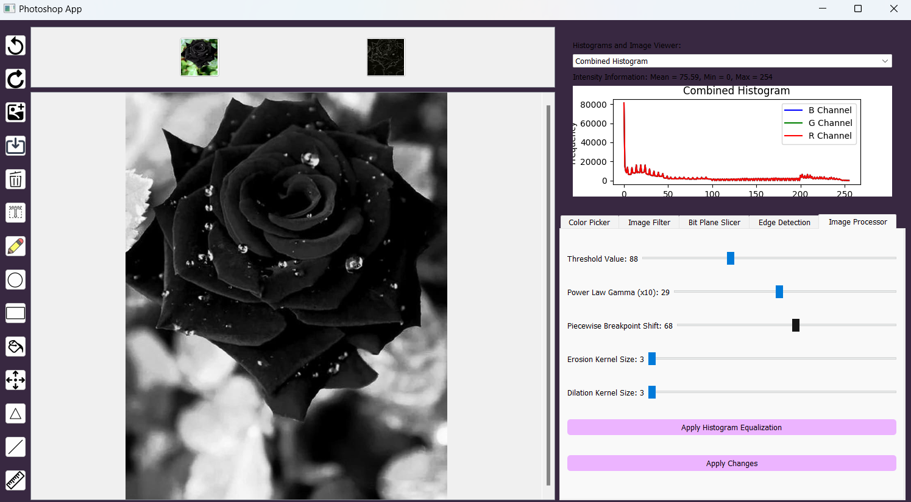

# Photoshop App

## Description
This project is an assignment to create a Photoshop app that meets the task requirements, image editing with drawing tools, filters, edge detection, bit plane slicing, and histogram visualization built with PyQt5 and OpenCV.

## Technologies Used
- Python
- PyQt5
- OpenCV (cv2)
- NumPy
- Matplotlib
- QGraphicsView Framework
- QColorDialog
- QFileDialog
- QScrollArea
- Thumbnail Management
- Ruler Overlay

## System Screenshots

### System Interface

### Changes made on Image Filter Tab

### Changes made on Bit Plane Slicer Tab

### Changes made on Edge Detection Tab

### Changes made on Image Processor Tab

