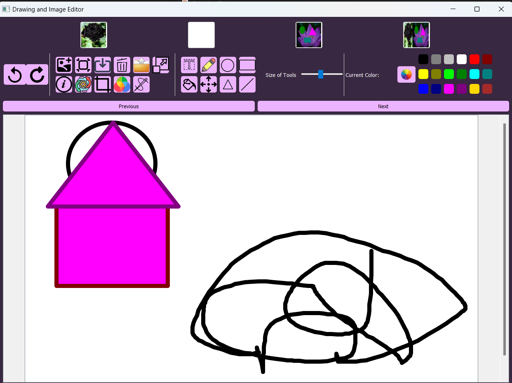
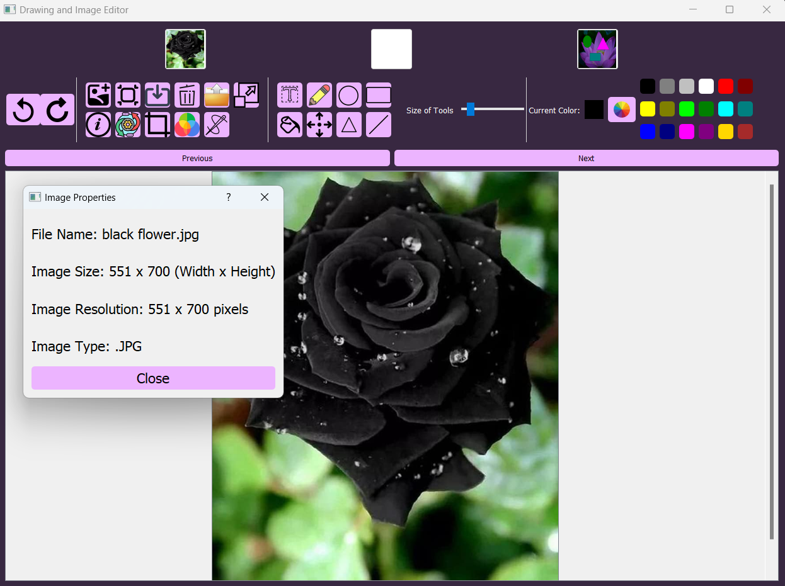
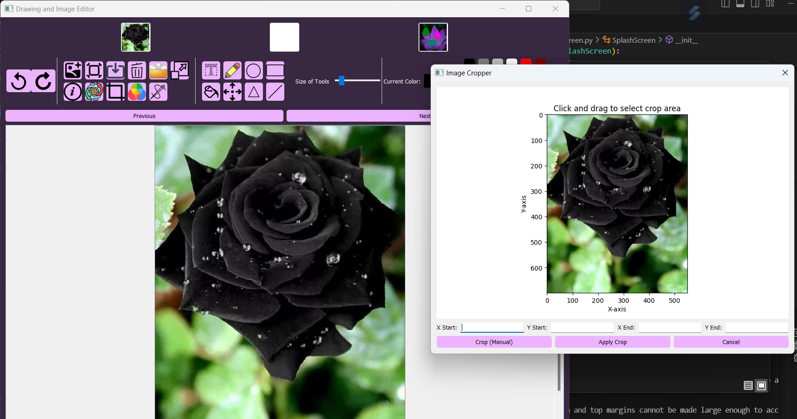
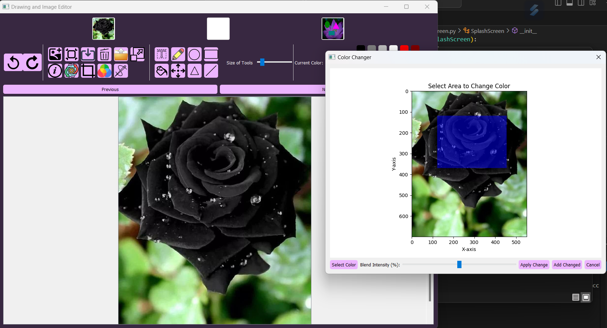
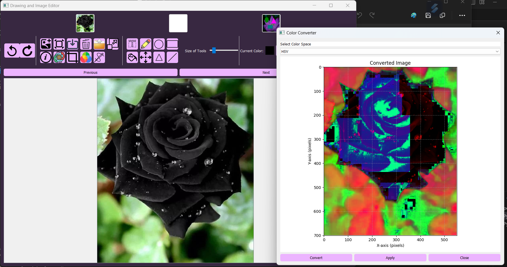
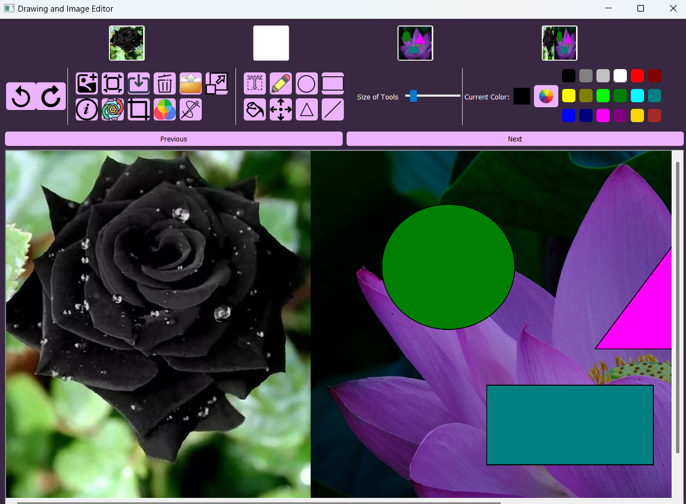
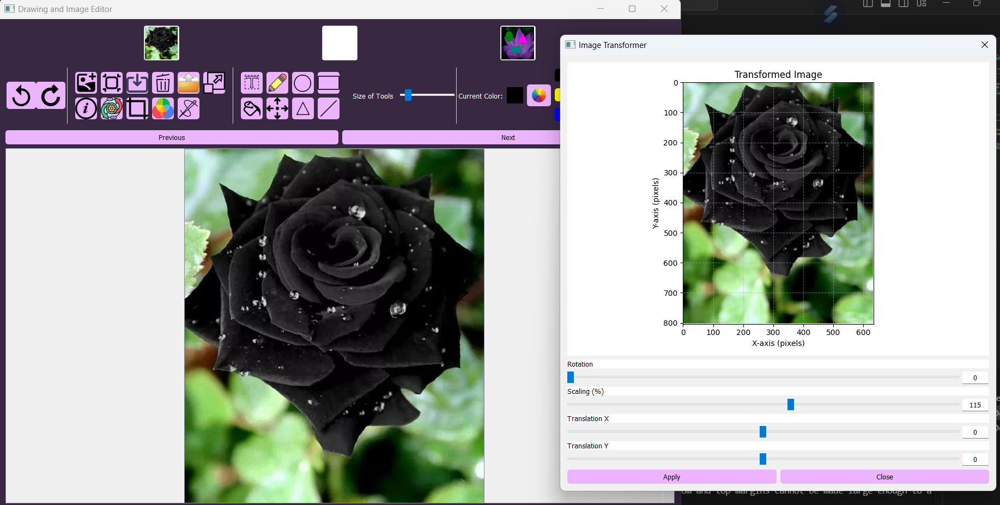
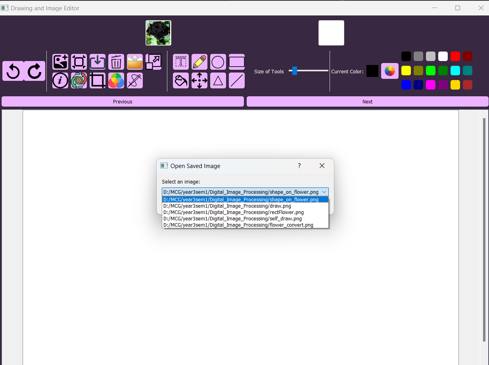

# Paint Editor

## Description
This project is an assignment to create a Paint Editor that meets the task requirements: an image-editing and drawing application with tools for colour manipulation, geometric transformations, stitching, cropping, and annotation, built with PyQt5 and OpenCV.

## Technologies Used
- Python
- Deep Learning
- CNN
- CNN Structured Denoising Method
- U-Net Segmentation

## System Screenshots

### System Interface

### Display Image Info

### Cropping Image

### Changing the color pixel

### Convert color 

### Stitching images

### Rotate, Scale and Translate Image 

### Opening Saved Image

