# Bouncing Ball Game

## Description
This project is an assignment that requires students to creatively design a game centred on a bouncing ball.

## Technologies Used
- Python
- Deep Learning
- CNN
- CNN Structured Denoising Method
- U-Net Segmentation

## System Screenshots

### System Interface
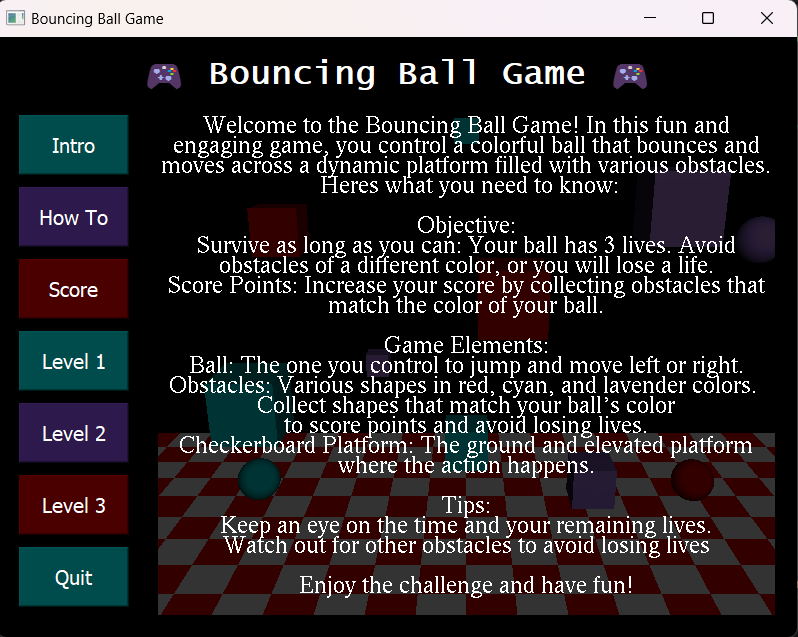

### Tutorial Level's Interface
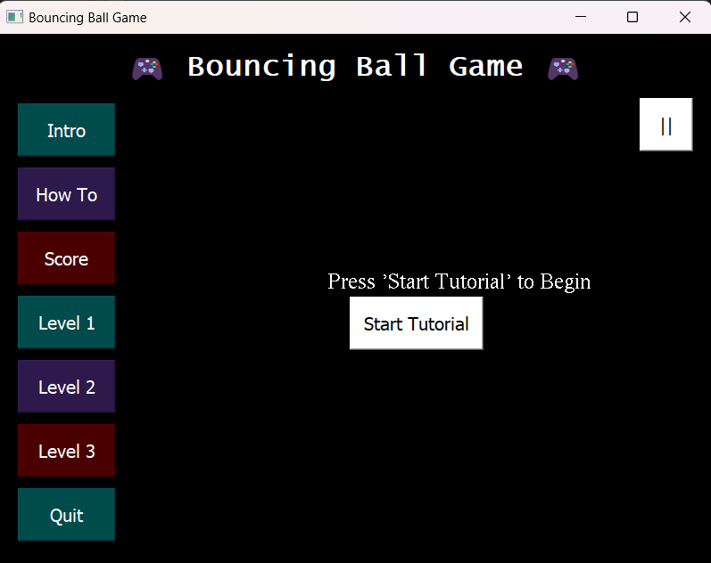

### Tutorial Level
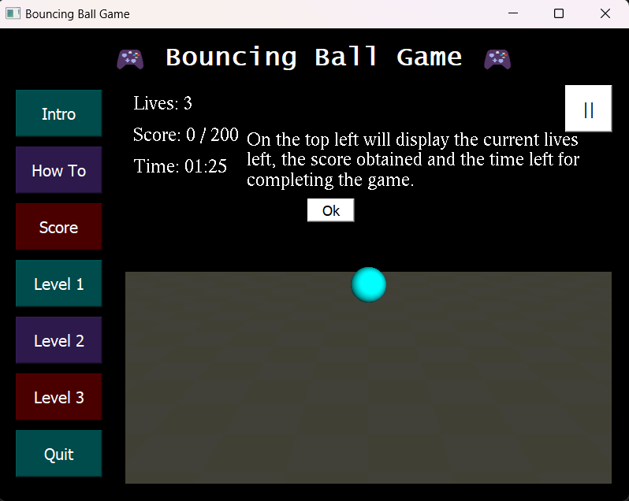

### Level's Interface
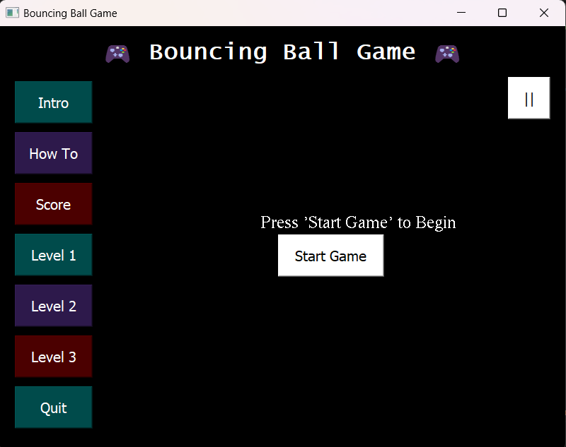

### Level 1
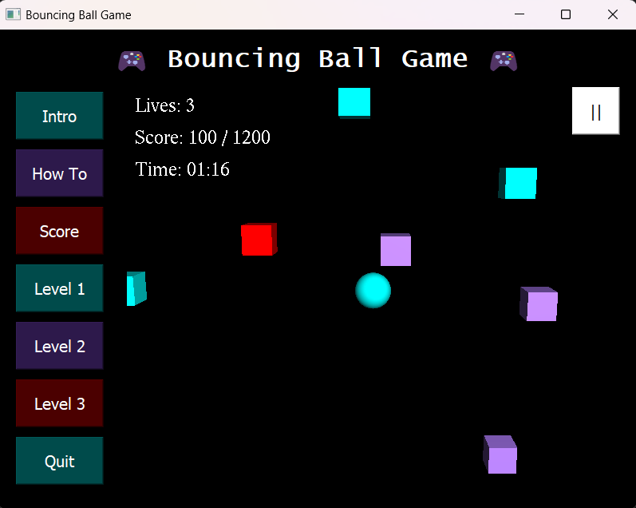

### Pausing Interface
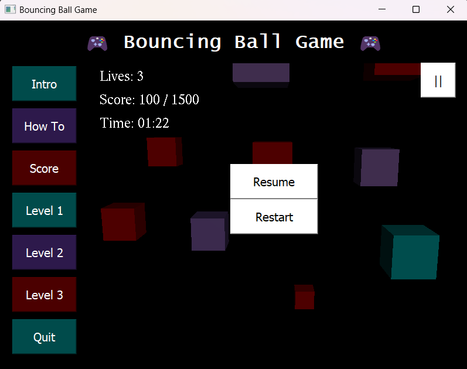

### Level 2
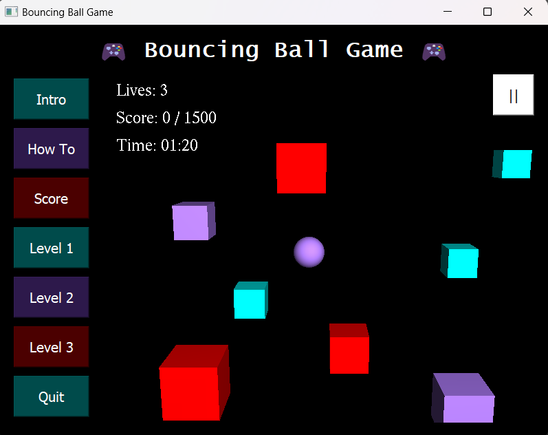

### Level 3
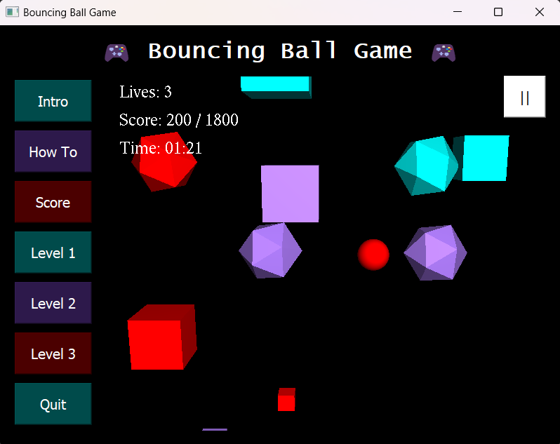

### Interface When Losing
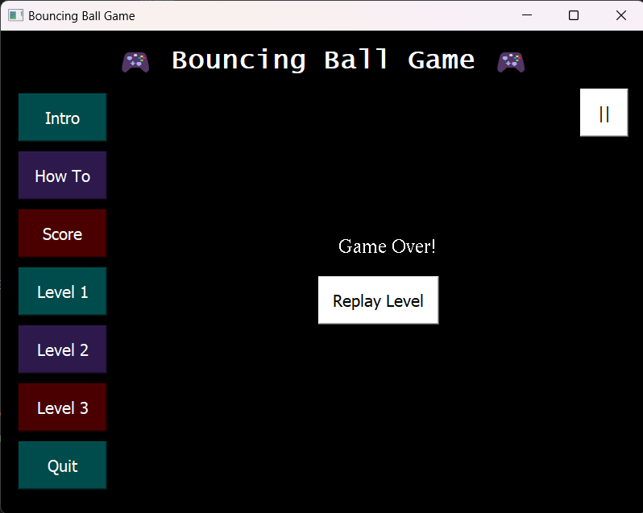

### Interface When Winning
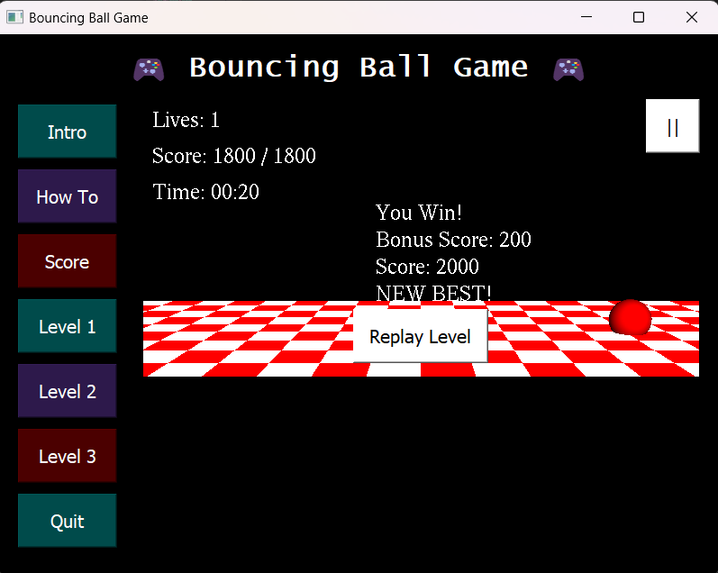

### Score Board
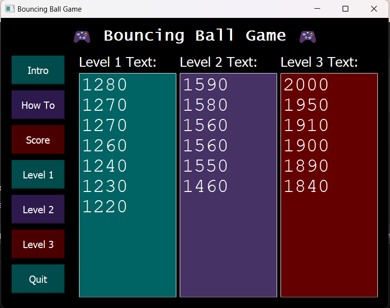

