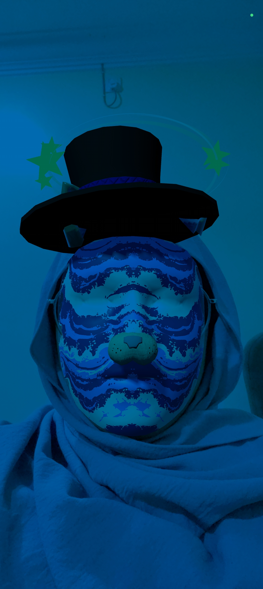

# Bouncing Ball Game

## Description
This project is an assignment that utilizes Unity Hub Application to explore the functions from the provided prefab to create a Face Filter App.

## Technologies Used
- Python
- Deep Learning
- CNN
- CNN Structured Denoising Method
- U-Net Segmentation

## System Screenshots

### Face Filter

