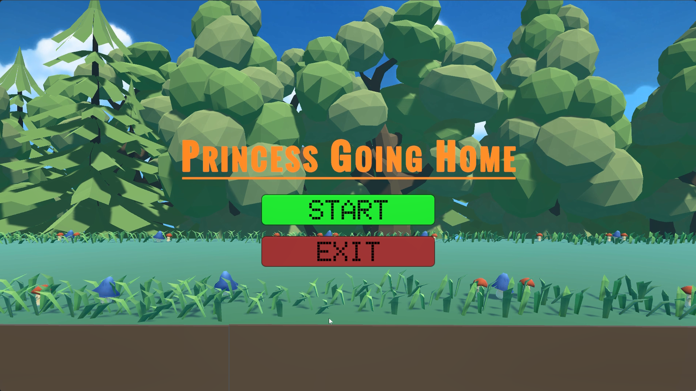
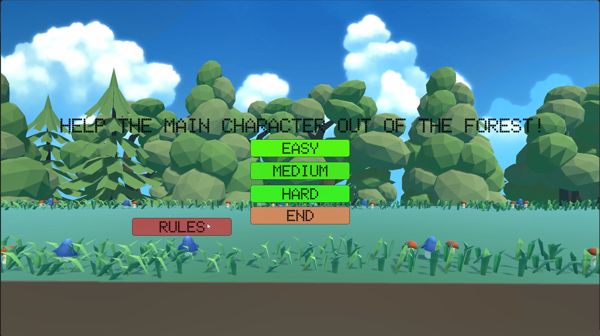
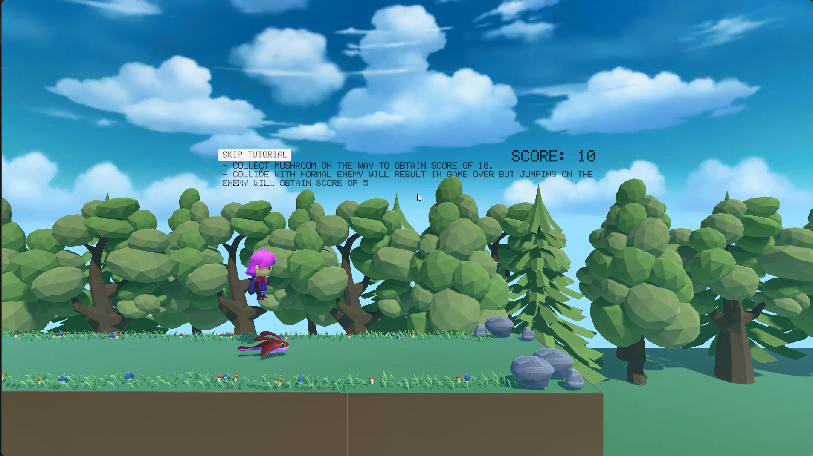
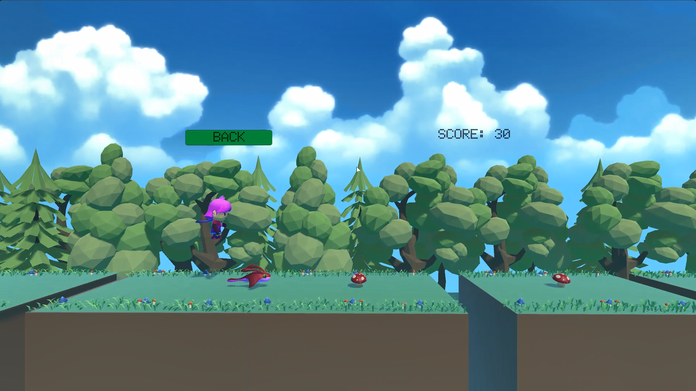
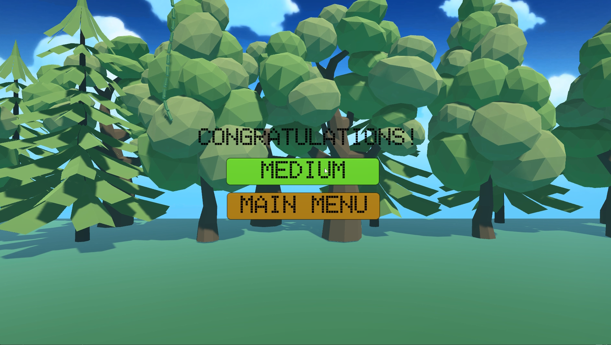
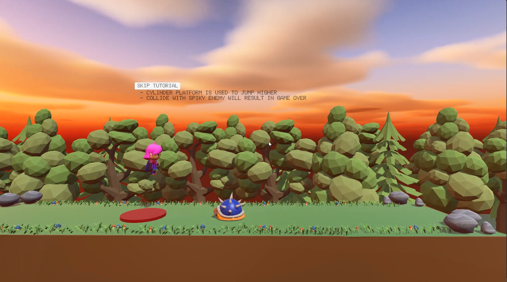
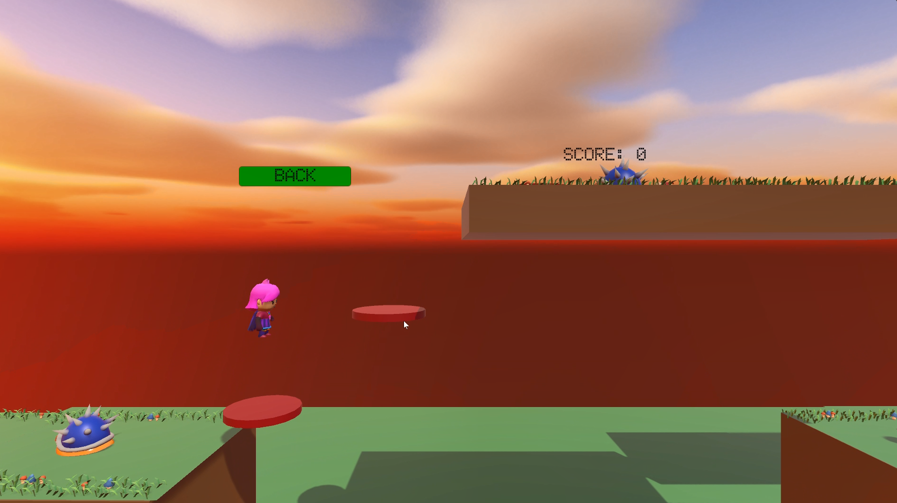
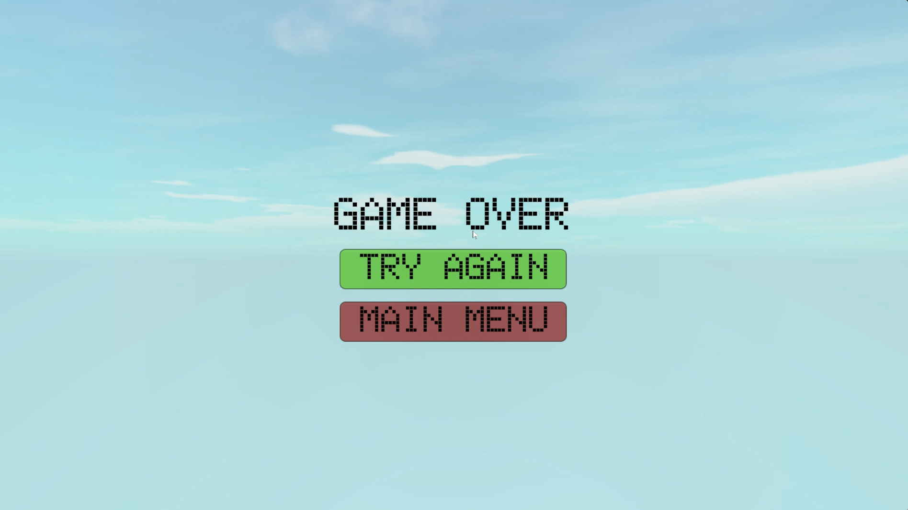
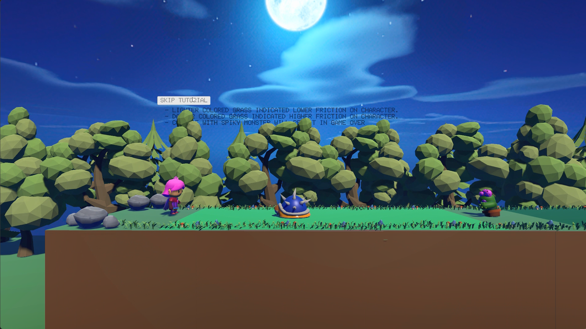
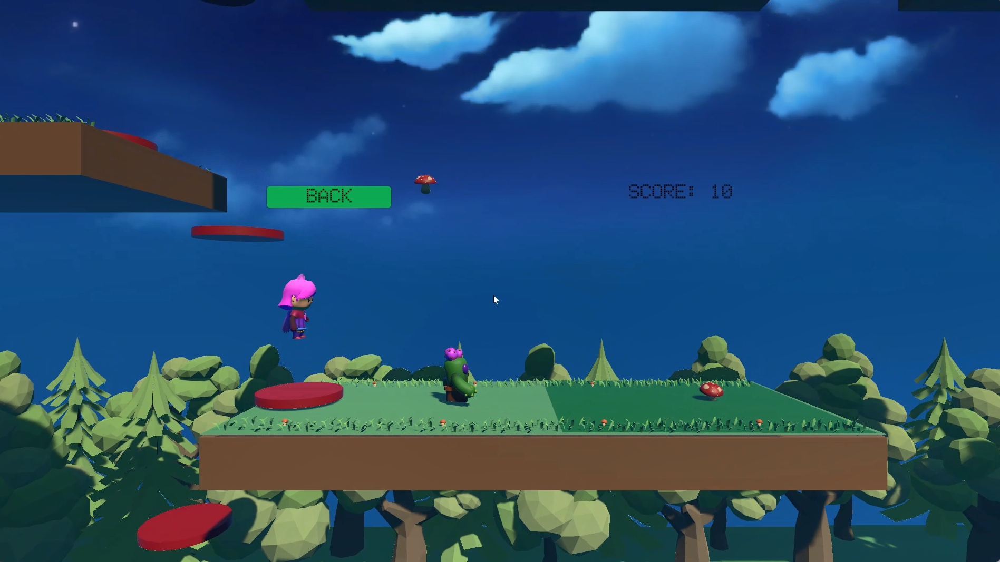

# Unity Game

## Description
This project is a group of 4 mini project given to students to design a game, either in 2D or 3D, by utilizing the functions available in Unity, with prefabs from the Unity Store. The game my group made is a 2D platform game where the player controls a character navigating through a forest level, collecting mushrooms, defeating enemies, and overcoming obstacles to find the way home.

## Technologies Used
- Unity
- C#
- Unity GameObjects
- Unity Prefabs
- Unity Physics System
- Unity Input Manager
- Unity Scene Management
- Unity Audio System
- nity Material System
- 2D Game Mechanics
- PC Platform 

## System Screenshots

### System Interface

### Home Interface

### Tutorial for Level 1

### Level 1

### Next Level Interface

### Tutorial for Level 2

### Level 2

### Game Over Interface

### Tutorial for Level 3

### Level 3

