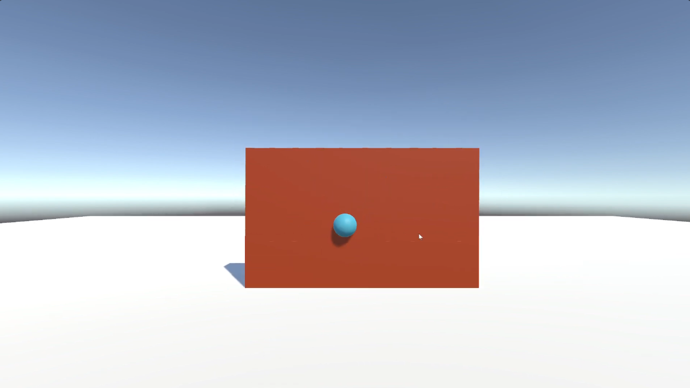
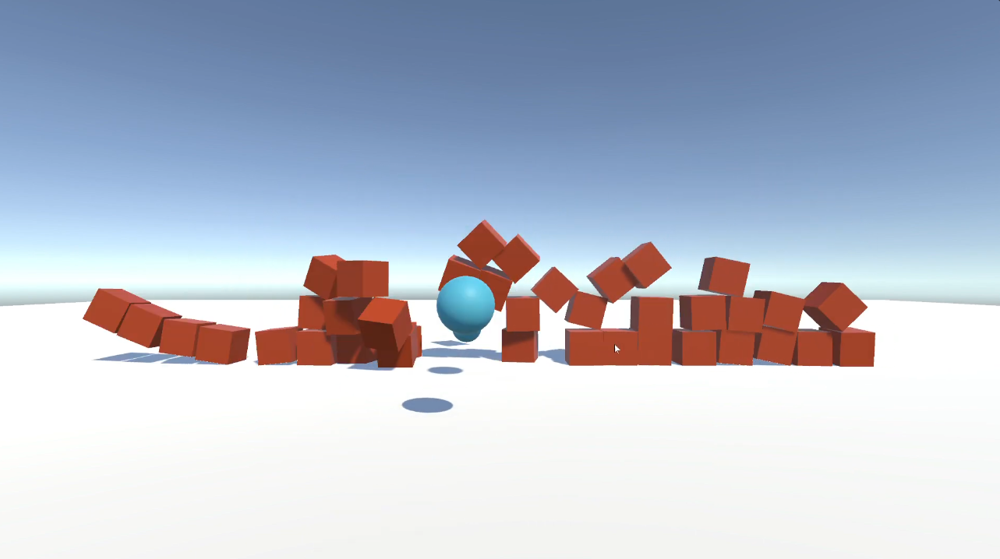

# Shooter Game

## Description
This project is a task that utilizes the Unity Hub Application to explore the Physics functions available in the app and create a Shooter Game using Unity, where the player controls a camera to launch spheres at stacked cube formations, with collision-triggered destruction and background music.

## Technologies Used
- Unity
- C#
- Unity GameObjects
- Unity Prefabs
- Unity Physics System
- Unity Input Manager
- Unity Scene Management

## System Screenshots

### Shooting the ball

### Wall collapsed after colliding with the ball

