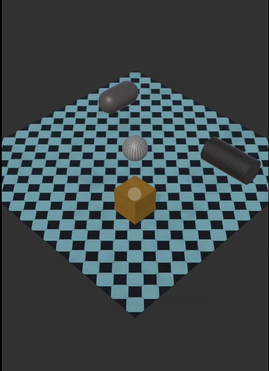
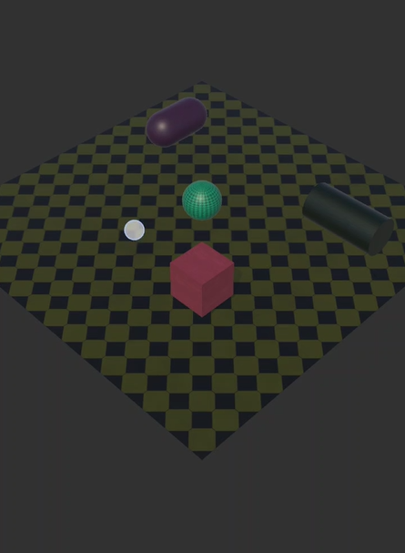

# Touch Input

## Description
This project is a task that utilizes Unity Hub Application to explore the functions from the provided prefab to create a mobile app that is able to utilize the touch input function. The task is to create an Android-based interactive 3D scene in which touching objects changes their appearance via touch input and raycast detection.

## Technologies Used
- Unity
- C#
- Unity GameObjects
- Unity Touch Input System
- Unity Raycasting
- Unity Material System
- Android Platform
- Unity Inspector Window

## System Screenshots

### Touch Input

### Touch Input

